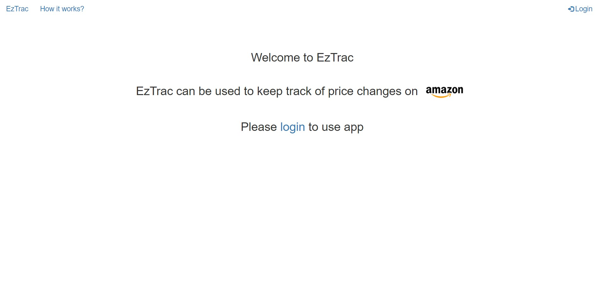
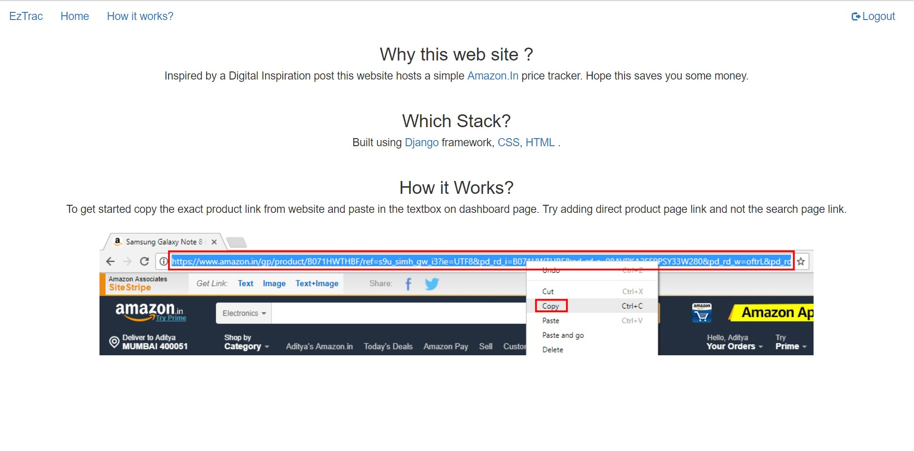
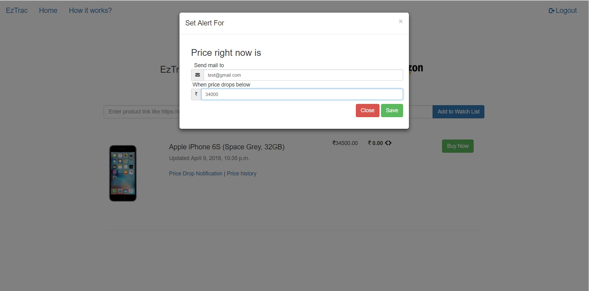
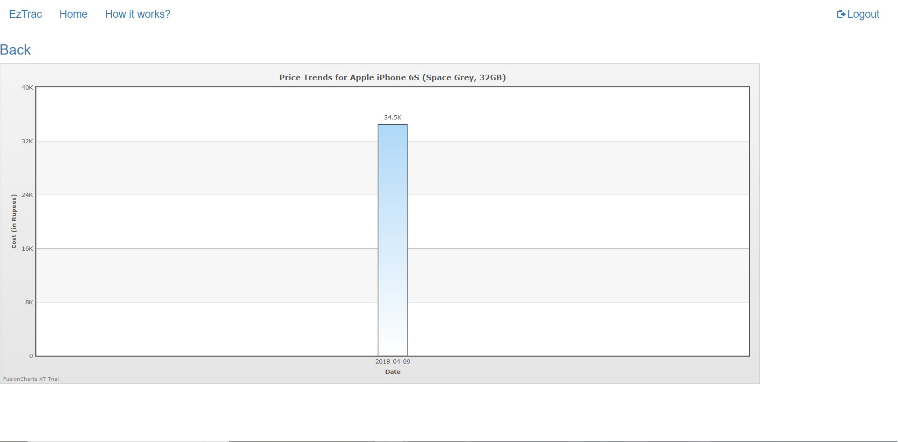

### EzTrac
## Synopsis
EzTrac is built on Python’s Django​ Web framework. EzTrac is a Amazon.in product price tracker. The user inputs the product link and the website tracks the product price and informs the user if the price falls below the user specified threshold using e-mail. The product price fluctuation graph is also maintained for better price tracking.
## Screenshots
Initial Screen

How it works

Product Notification

Product Graph

